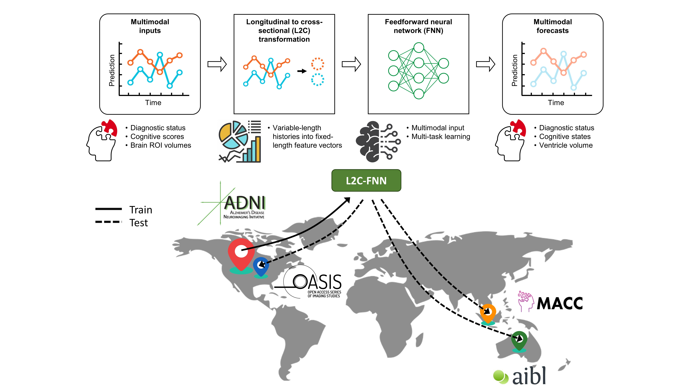

# Cross-dataset evaluation of dementia longitudinal progression prediction models


## References

- Zhang, C., An, L., Wulan, N., Nguyen, K. N., Orban, C., Chen, P., Chen, C., Zhou, J. H., Liu, K., Yeo, B. T. T., 2024. [Cross-dataset Evaluation of Dementia Longitudinal Progression Prediction Models](https://doi.org/10.1101/2024.11.18.24317513), medRxiv

----

## Background
Accurate Alzheimer’s Disease (AD) progression prediction is essential for early intervention. The TADPOLE challenge, involving 92 algorithms, used multimodal biomarkers of observed historical visits to predict future clinical diagnosis, cognition, and brain atrophy. The winning algorithm, FROG, employed a Longitudinal-to-Cross-sectional (L2C) transformation to convert variable longitudinal histories into fixed-length feature vectors—contrasting with most existing approaches that model entire longitudinal sequences (e.g., AD Course Map and MinimalRNN). In this project, we extend FROG by unifying its XGBoost components into a single feedforward neural network (L2C-FNN), and systematically evaluate its generalizability by training on the ADNI dataset and testing on three external cohorts—covering 2,312 participants and over 13,200 timepoints. L2C-FNN demonstrates strong and consistent performance across datasets, underscoring its potential for long-term dementia progression prediction.

<p align="center">

</p>

----

## Folder structure
* `data_processing`: Contains Python files for data splitting (train/validation/test), L2C feature transformation, and preprocessing to prepare data for model input.
* `examples`: Contains scripts for generating demo data and example use of the models.
* `models`: Contains Python files for training and evaluating the models.
* `predict_only`: Contains scripts for predicting dementia progression using pretrained L2C-FNN models on your own dataset.
* `readme_figures`: Graphical abstract of the paper, providing high-level understanding of pipeline.
* `replication`: Contains scripts for replicating the results.
* `unit_tests`: Uses `examples` demo data to check validity of the code.
* `utils`: Helper functions for evaluating model performance and comparing against reference results.

----

## Code Release

### Download stand-alone repository
Since the whole Github repository is too big, we provide a stand-alone version of only this project and its dependencies. To download this stand-alone repository, visit this link: [https://github.com/ThomasYeoLab/Standalone_Zhang2025_L2CFNN](https://github.com/ThomasYeoLab/Standalone_Zhang2025_L2CFNN)

### Download whole repository
If you want to use the code from our lab's other stable projects (other than Zhang2025_L2CFNN), 
you would need to download the whole CBIG repository.

- To download the version of the code that was last tested, you can either

    - visit this link:
    [https://github.com/ThomasYeoLab/CBIG/releases/tag/v0.35.0-Zhang2025_L2CFNN](https://github.com/ThomasYeoLab/CBIG/releases/tag/v0.35.0-Zhang2025_L2CFNN)

    or

    - run the following command, if you have Git installed
 
    ```
    git checkout -b Zhang2025_L2CFNN v0.35.0-Zhang2025_L2CFNN
    ```
----

## Usage

### Environment setup
- Our code uses Python, here is the setup:
    1. Install [Miniconda](https://docs.conda.io/en/latest/miniconda.html) or 
       [Anaconda](https://www.anaconda.com/distribution/#download-section) with Python 3.x if you don't have conda
    2. Create conda environment from our yml/txt files in `replication/config` file by: 
        ```
        cd $CBIG_CODE_DIR/stable_projects/predict_phenotypes/Zhang2025_L2CFNN
        conda env create -f replication/config/CBIG_L2CFNN_python_env.yml
        bash replication/scripts/CBIG_L2CFNN_install_env.sh
        ```

### Example
- The example of our code is detailed in `examples/README.md`

### Replication
- If you have access to ADNI, AIBL, MACC, and OASIS datasets, you can replicate our results 
  using the instructions detailed in `replication/README.md`.

### Predict_only
- If you would like to use the pretrained ADNI models on your own dataset to perform predictions, please refer to detailed instructions in `predict_only/README.md`
----

## Updates

- Release v0.35.0 (03/06/2025): Initial release of Zhang2025_L2CFNN project

----


## Bugs and Questions

Please contact Chen Zhang at chenzhangsutd@gmail.com and Thomas Yeo at yeoyeo02@gmail.com

