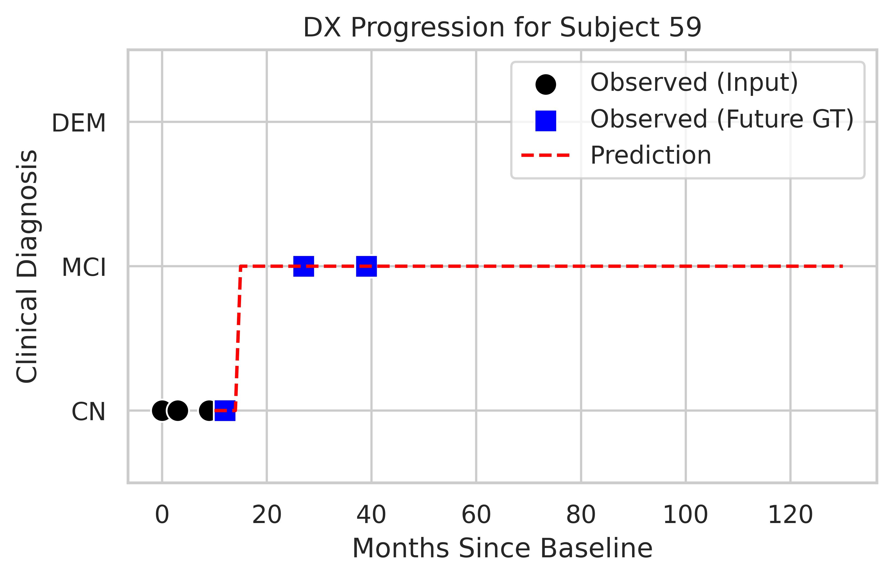
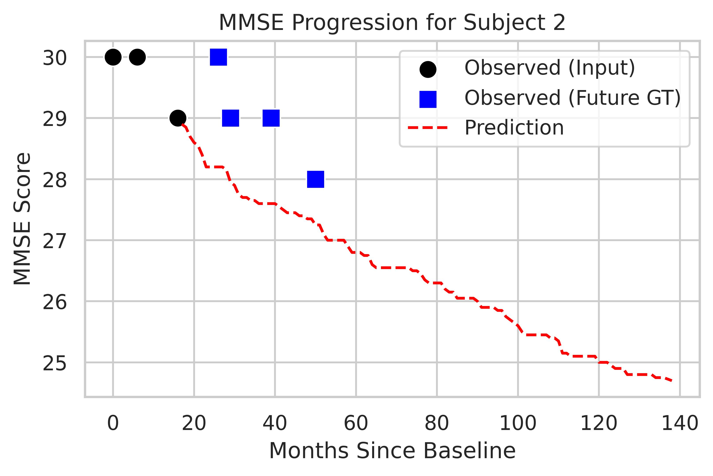

# Example: Predicting Dementia Progression Using Pretrained L2C-FNN Models

In this tutorial, we demonstrate how to use our pretrained L2C-FNN models to predict long-term dementia progression. Specifically, we use the first half of each subject’s longitudinal data to predict three key outcomes for the next 10 years (120 months):
- Clinical diagnosis (CN, MCI, DEM)
- Cognitive function, measured by Mini-Mental State Examination (MMSE)
- Brain atrophy, measured by ventricle volume

Although this example uses simulated dummy data for demonstration purposes, users can easily substitute their own dataset by following the same format.

This example reflects the setup described in Section 3.2 (Cross-Cohort Prediction) of our paper. In the paper, we evaluated prediction performance using 20 independently trained models on ADNI, which allows for robust benchmarking and statistical comparisons. Here, our goal is to produce the best possible prediction for a new dataset.

To improve accuracy, we optionally support ensemble prediction—users can combine results from multiple pretrained models. By default, the code will use all 20 models, but you can reduce this number depending on your available compute resources or time constraints. Even using a single model can provide reasonably accurate predictions.

----

## Usage
### 1. Preparations before running the code
Before running the example, please follow the environment setup instructions provided in the `README.md` file of the main project directory (or the one inside the `replication` folder). These steps ensure that all dependencies are properly configured.

If you want to make predictions on your own dataset, ensure that your file is in CSV format and follows the same structure as the provided example file: `raw_data/SampleData.csv`. Place your CSV file (e.g., `MyTest.csv`) in the `raw_data/` directory so that the code can automatically locate it.

----

### Required CSV Format

Each row in the dataset should represent a single clinical visit for one individual. For example, if a individual has 10 visits recorded, there should be 10 rows corresponding to that individual.

Your CSV must include the following columns with compatible formats (we sticked to the commonly used ADNIMERGE format here):
    
1. **RID**: Unique individual ID (string or integer).
2. **VISCODE**: Visit identifier. Use `"bl"` for the baseline visit, and `"mN"` (e.g., `"m12"`, `"m24"`) for follow-ups, where `N` is months since baseline.
3. **Month_bl**: Months since baseline (integer, derived from `EXAMDATE`).
4. **EXAMDATE**: Date of clinical exam in `YYYY-MM-DD` format.
5. **PTEDUCAT**: Years of education (integer).
6. **PTGENDER**: Sex (1 = male, 2 = female).
7. **APOE**: APOE-ε4 allele count (0, 1, or 2).
8. **PTMARRY**: Marital status. Acceptable values (string):
    * Married
    * Widowed
    * Divorced
    * Never married
    * Unknown
9. **MMSE**: Mini-Mental State Examination score (integer, 0-30)
10. **DX**: clinical diagnosis, integer mapped as:
    * 0 = Cognitively Normal (CN)
    * 1 = Mild Cognitive Impairment (MCI)
    * 2 = Dementia (DEM)
11. **CDR**: Clinical Dementia Rating – Global Score (float). Allowed values:
    * 0.0 = Normal
    * 0.5 = MCI
    * 1.0 = Mild dementia
    * 2.0 = Moderate dementia
    * 3.0 = Severe dementia
12. **Brain ROI Volumes** (float values). For details on how these are derived, refer to Section 2.2.2 and Supplemental Table S5 of our paper:
    * Hippocampus
    * Fusiform
    * MidTemp
    * Ventricles
    * ICV
    * WholeBrain
13. **AGE**: Age at visit (float). Can be computed using baseline age and EXAMDATE.
14. **SCANDATE**: Date of brain imaging scan in `YYYY-MM-DD` format.

📌 Note: `EXAMDATE` and `SCANDATE` can differ by up to 6 months. If the gap is larger, we recommend treating them as two separate visits:

* One visit includes cognitive assessment (e.g., MMSE, DX, CDR) with `EXAMDATE`.
* The other visit includes imaging biomarkers (e.g., brain ROIs) with `SCANDATE`.
* Both visits must still include shared metadata such as `RID`, `VISCODE`, `Month_bl`, `PTEDUCAT`, `PTGENDER`, `APOE`, and `PTMARRY`.

----
### 2. Running the code
#### Running on example dataset
To verify that the code is functioning correctly, you can run it using the provided example dataset located at `raw_data/SampleData.csv`. Simply use the default settings with the following command in the terminal:

```
cd $CBIG_CODE_DIR/stable_projects/predict_phenotypes/Zhang2025_L2CFNN

bash predict_only/CBIG_L2CFNN_predict_only.sh --plot
```

This script performs the following steps:
1. Preprocesses the input data into the format required by the L2C-FNN model
2. Runs the pretrained models to generate predictions and compute evaluation metrics
3. Plots the predicted longitudinal trajectories for all 200 sample individuals
4. Compares your results against reference outputs to confirm that the code is working as intended

You are expected to get the same results as following:

```
Starting comparison...
Loading results for Model: L2C_FNN, Site: SampleData...
  [L2C_FNN/SampleData/mAUC] (Mean: 0.809667)
  [L2C_FNN/SampleData/mmseMAE] (Mean: 1.854517)
  [L2C_FNN/SampleData/ventsMAE] (Mean: 0.001969)

============================== Summary ==============================
Processed 1 Model/Site combinations.
Performed 3 comparisons.
All comparisons passed successfully!
======================================================================
```

Results will be saved in `predictions/L2C_FNN/SampleData`, including: 
- Predictions from each model (e.g., `old_metric/prediction_0.csv`) 
- Ensembled predictions (in `old_metric/ensembled_prediction.csv`) 
- Group-level metrics (in `old_metric/out.json`, e.g., mAUC for clinical diagnosis)
- Individual-level metrics (in `new_metric/out.json`, e.g., MAE for MMSE and ventricle volume)

See Section 2.11 of the manuscript for a detailed explanation of these metrics.

Trajectory plots will be generated in `trajectory_plots/SampleData`, organized into three subfolders corresponding to the prediction targets: **diagnosis (DX)**, **MMSE**, and **ventricle volume**. Example plots are shown below.
- Black dots = observed data at input timepoints (first half)
- Blue squares = future ground-truth data (second half)
- Red dotted line = predicted trajectory over 120 months starting from the last input timepoint

<p align="center">
  
  
  
</p>

Once you've confirmed that everything is working, you're ready to use the model on your own dataset.

----

#### Running on Your Own Data
You can customize the script through the following input arguments:

| Argument        | Description                                                                                                                              |
| --------------- | ---------------------------------------------------------------------------------------------------------------------------------------- |
| `--seed`        | Random seed for reproducibility (default: 3)                                                                                             |
| `--n_ensemble`  | Number of models to ensemble (default: 20). Even a single model can produce reasonably accurate results.                                 |
| `--site`        | Dataset name (should match the filename in `raw_data/`, e.g., `MyTest` for `MyTest.csv`; default: SampleData)                            |
| `--batch_size`  | Number of samples per batch. Larger values speed up computation but use more GPU memory (default: 512)                                   |
| `--plot`        | Flag to enable trajectory plotting                                                                                                       |
| `--total_count` | Number of individuals to plot. Can be an integer, `"all"`, or left as default (`None`) to plot all                                       |
| `--device`      | Device to run the model on (e.g., `"cuda"`, `"cpu"`, `"cuda:0"`, `"mps"`). If unspecified, the script will auto-detect CUDA availability |

For example, to use your own dataset `MyTest.csv` with a batch size of 1024 and only 5 ensemble models, you can run:

```
cd $CBIG_CODE_DIR/stable_projects/predict_phenotypes/Zhang2025_L2CFNN

bash predict_only/CBIG_L2CFNN_predict_only.sh --site MyTest --batch_size 1024 --n_ensemble 5
```

This will execute the first two steps (and the third if `--plot` is specified):
1. Preprocess data
2. Run pretrained models for prediction and evaluation
3. (Optional) Plot predicted trajectories for N individuals

All results will be saved under: `predictions/L2C_FNN/MyTest`.

If you specified `--plot`, the predicted trajectories will be saved under `trajectory_plots/MyTest`

----

### 3. Clean up

To remove all generated files and restore the workspace to its original state, you can run the following commands (or delete the folders manually if you prefer):
```
rm -rf $CBIG_CODE_DIR/stable_projects/predict_phenotypes/Zhang2025_L2CFNN/predict_only/data
rm -rf $CBIG_CODE_DIR/stable_projects/predict_phenotypes/Zhang2025_L2CFNN/predict_only/predictions
rm -rf $CBIG_CODE_DIR/stable_projects/predict_phenotypes/Zhang2025_L2CFNN/predict_only/trajectory_plots
```
----

## References

- Zhang, C., An, L., Wulan, N., Nguyen, K. N., Orban, C., Chen, P., Chen, C., Zhou, J. H., Liu, K., Yeo, B. T. T., 2024. [Cross-dataset Evaluation of Dementia Longitudinal Progression Prediction Models](https://doi.org/10.1101/2024.11.18.24317513), medRxiv

## Bugs and Questions
Please contact Chen Zhang at chenzhangsutd@gmail.com, Naren Wulan at wulannarenzhao@gmail.com, and Lijun An at anlijuncn@gmail.com